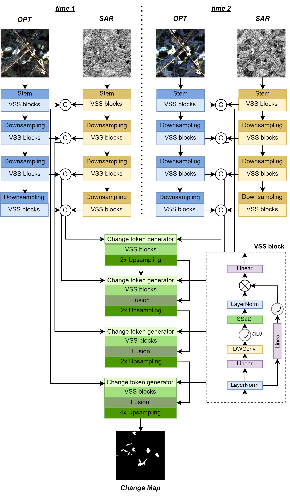

<div align="center">
<h1 align="center">MCD-Mamba</h1>

<h3>MCD-Mamba: Mamba-Based Framework for Infrastructure Change Detection using Multimodal Satellite Imagery</h3>

[Mira Kenzhebay](https://orcid.org/0009-0008-3802-2850) *</sup>, [Reza Arghandeh](https://orcid.org/0000-0002-0691-5426)


Western Norway University of Applied Sciences

 <sup>*</sup> Corresponding author

 </div>

## 🔭Overview
Change detection using remote sensing data has shown remarkable progress through deep learning approaches, particularly with Convolutional Neural Networks (CNNs) and Transformers, yet both architectures face limitations either in terms of computational efficiency or accuracy. This paper introduces MCD-Mamba (Multimodal Change Detection Mamba), a novel framework that leverages state space modeling for efficient multimodal change detection using both optical and Synthetic Aperture Radar (SAR) data. The architecture features modality-specific Visual Mamba (VMamba) encoders with strategic weight sharing, an efficient multi-scale fusion strategy, and a novel Difference-based Spatio-Temporal (DST) block for modeling temporal changes. Experiments conducted on the Multimodal ONERA Satellite Change Detection (OSCD) dataset demonstrate that MCD-Mamba outperforms existing architectures, achieving a 61.01\% F-score, 65.96\% recall, and 81.30\% balanced accuracy. The model strikes an optimal balance between performance and efficiency, requiring moderate computational resources (7.1M parameters) while maintaining faster convergence compared to CNN and Transformer alternatives. Notably, a compact variant of the architecture achieves comparable performance while using only 4\% of the base model's parameters. Visual analysis reveals that MCD-Mamba exhibits superior sensitivity in urban environments and better captures fine-grained changes in scattered urban structures compared to existing methods. These results demonstrate the potential of state space modeling for multi-modal remote sensing applications, offering a promising direction for efficient and accurate infrastructure change detection.

<p align="center">
  
</p>


## 🗝️Let's Get Started!
### `A. Installation`


The repo is based on the [VMama repo](https://github.com/MzeroMiko/VMamba) and [MambaCD](https://github.com/ChenHongruixuan/MambaCD). The following installation sequence is taken from the VMamba repo. 

**Step 1: Clone the repository:**

Clone this repository and navigate to the project directory:
```bash
git clone https://github.com/ci2lab/MCD.git
cd MambaCD
```


**Step 2: Environment Setup:**

It is recommended to set up a conda environment and installing dependencies via pip. Use the following commands to set up your environment:

***Create and activate a new conda environment***

```bash
conda create -n changemamba
conda activate changemamba
```

***Install dependencies***

```bash
pip install -r requirements_upd.txt
cd kernels/selective_scan && pip install .
```


***Dependencies for "Detection" and "Segmentation" (optional in VMamba)***

```bash
pip install mmengine==0.10.1 mmcv==2.1.0 opencv-python-headless ftfy regex
pip install mmdet==3.3.0 mmsegmentation==1.2.2 mmpretrain==1.2.0
```

### `B. Data Preparation`
***Binary change detection***
The [OSCD](https://ieee-dataport.org/open-access/oscd-onera-satellite-change-detection) is used for binary change detection experiments. Please download it and make it have the following folder/file structure:
```
${DATASET_ROOT}   # Dataset root directory, for example: /home/mira/Data/Onera
├───S1
│   ├───abudhabi
│   │   ├───imgs_1
│   │   │   ├───preview
│   │   │   └───transformed
│   │   │           S1A_IW_GRDH_1SDV_20160218T142406_20160218T142442_010002_00EB50_77FE.tif
│   │   └───imgs_2
│   │       ├───preview
│   │       └───transformed
│   │               S1A_IW_GRDH_1SDV_20180327T142413_20180327T142438_021202_024756_B24C.tif
│   ├───aguasclaras
│   │   ├───....
│   ├───....
├───S2
│   ├───abudhabi
│   │   ├───imgs_1
│   │   ├───imgs_1_rect
│   │   │       B01.tif
│   │   │       B02.tif
│   │   │       B03.tif
│   │   │       ....
│   │   ├───imgs_2
│   │   ├───imgs_2_rect
│   │   │       B01.tif
│   │   │       B02.tif
│   │   │       B03.tif
│   │   │       ....
│   │   └───pair
│   ├───aguasclaras
│   │   ├───...
│   ├───....
├───Train Labels
│   ├───abudhabi
│   │   └───cm
│   │           abudhabi-cm.tif
│   │           cm.png
│   ├───aguasclaras
│   │   └───...
    ├───....
└───Test Labels
    ├───brasilia
    │   └───cm
    │           brasilia-cm.tif
    │           cm.png
    ├───chongqing
    │   └───...
    ├───....

```

### `C. Model Training`
To train models, change working directory to  [`changedetection`] folder, which contains all the code for network definitions, training and testing. 

```bash
cd <project_path>/MCD-Mamba/changedetection
```

***Binary change detection***

The following commands are examples of how to train and evaluate MCD-Mamba-compact on the multimodal OSCD dataset:
```bash

python3 changedetection/script/train_ONERA.py --cfg 'changedetection/configs/vssm1/vssm_compact_224.yaml' 
                                              --dataset_path /content/drive/MyDrive/Data/ONERA   
                                              --model_param_path 'changedetection/saved_models' 
                                              --patch_size 224  
                                              --type train 
                                              --model 'STMambaBCD_multimodal' 
                                              --dataset 'ONERA-multimodal' 
                                              --epochs 100 
                                              --learning_rate 1e-3 
                                              --batch_size 16 
                                              --lovasz_weight 0.7 
                                              --opt_bands 13


### `D. Inference Using Saved Model'

python3 changedetection/script/infer_ONERA.py --cfg 'changedetection/configs/vssm1/vssm_compact_224.yaml' 
                                              --dataset_path /content/drive/MyDrive/Data/ONERA   
                                              --patch_size 224  
                                              --type test 
                                              --model 'STMambaBCD_multimodal' 
                                              --dataset 'ONERA-multimodal' 
                                              --resume 'changedetection/saved_models/ONERA-multimodal/STMambaBCD_multimodal/best_model.pth' 
                                              --result_saved_path 'changedetection/saved_models/ONERA-multimodal/STMambaBCD_multimodal'


```

## 📜Reference


```
@article{
}
```


## 🤝Acknowledgments
This project is based on [MambaCD](https://github.com/ChenHongruixuan/MambaCD), VMamba ([paper](https://arxiv.org/abs/2401.10166), [code](https://github.com/MzeroMiko/VMamba)), ScanNet ([paper](https://arxiv.org/abs/2212.05245), [code](https://github.com/ggsDing/SCanNet)), BDANet ([paper](https://ieeexplore.ieee.org/document/9442902), [code](https://github.com/ShaneShen/BDANet-Building-Damage-Assessment)). Big thanks for their brilliant works!!

## 🙋Q & A
***If you have any questions, please feel free to [contact us.](mailto:mken@hvl.no)***
